# Relationships ABM — findings so far

A narrated walkthrough of what the simulation has actually shown us. Every plot
in this document was generated by `analysis/build_report.py` from 16-seed
sweeps; rerun that script after adding scenarios.

## TL;DR

1. **Pure-marker stigma does not emerge from trait generalization alone.** With
   identical hidden behavior across groups, agents learn group-level priors
   that converge to the population mean — they don't fork into "us vs. them."
2. **Loss-aversion is the missing ingredient.** When a failure costs more
   trust than a success buys back, large per-seed trust gaps appear — but the
   sign is random per seed (some worlds distrust group A, some distrust
   group B). Average gap stays near zero; *magnitude* (|gap|) is what jumps,
   ~9× over the control.
3. **Wealth inequality alone does not produce trait-locked discrimination.**
   The Gini coefficient climbs to ~0.36 and stays there, but no trait-keyed
   trust gap forms.
4. **The simulation has a viability cliff.** With `base_success_prob = 0.3`
   and a venture cost > reward·prob the population goes extinct unless
   something props it up (low loss-on-failure, or higher base success). This
   constrained the loss-aversion experiments significantly.

---

## Experiment 2 — does pure-marker stigma emerge?

**Question:** if I label agents with arbitrary traits (think eye color) and let
agents generalize trust across same-trait neighbors, does a "racism by
accident" gap form between groups?

**Setup.** Three scenarios, 16 seeds each, 30 000 ticks:

| scenario | trait_generalization_strength | gain | loss |
|---|---|---|---|
| `markers_off`         | 0.0 | 0.15 | 0.10 |
| `markers_only`        | 0.6 | 0.15 | 0.10 |
| `markers_lossaverse`  | 0.6 | 0.10 | 0.15 |

Hidden behavior is identical across groups in all three runs — the only thing
that varies is whether agents *use* the trait labels and whether trust updates
are loss-averse.

### Within- vs across-group trust

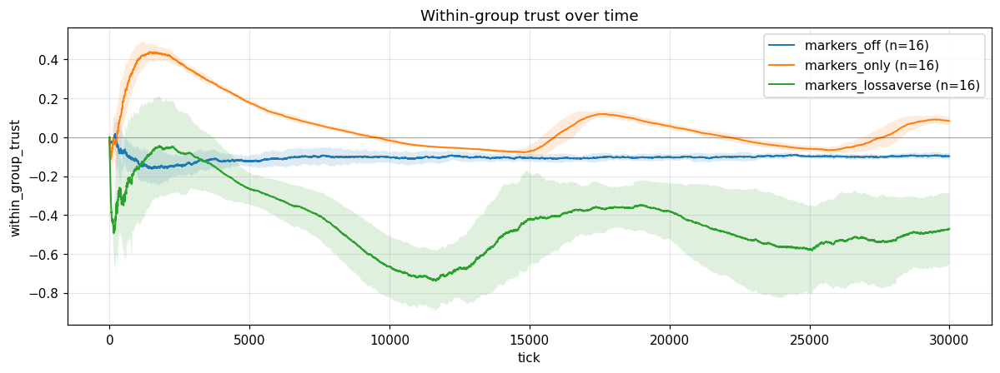
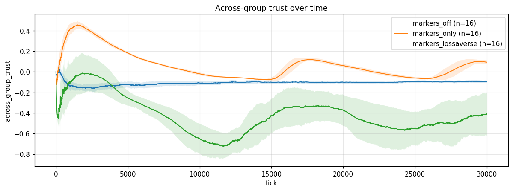

In `markers_off` (orange) and `markers_only` (green) the within-group and
across-group lines track each other tick-for-tick. Generalization didn't pull
them apart — it just moved everyone toward the same noisy mean. In
`markers_lossaverse` (red) both lines plunge together to ~−0.5 because every
relationship is decaying faster than it can build back up.

### Trust gap (within − across)

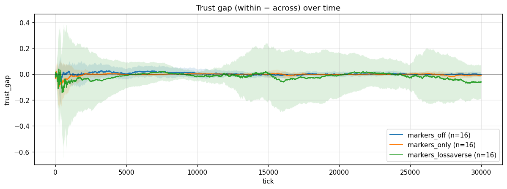

Mean gap is near zero in all three. **But that hides the real story.** Look
at the per-seed traces:

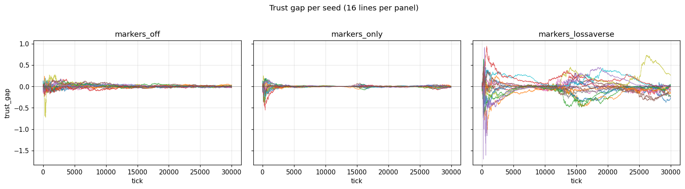

- `markers_off` and `markers_only`: tight band around zero. Each seed is
  noisy; nothing locks in.
- `markers_lossaverse`: each seed wanders to a *large* nonzero gap, but the
  sign is random across seeds. Some worlds end up trusting group A more, some
  trusting group B more. Average them and you get zero; ignore the sign and
  you get a huge effect.

### Late-stage summary (last 5 000 ticks, averaged across seeds)

| scenario | n_survived | population | mean_trust | within | across | gap | \|gap\| |
|---|---|---|---|---|---|---|---|
| markers_off        | 16 | 59.6  | −0.091 | −0.098 | −0.096 | −0.002 | 0.009 |
| markers_only       | 16 | 113.6 | +0.010 | +0.006 | +0.012 | −0.006 | 0.012 |
| markers_lossaverse | 16 | 51.8  | −0.467 | −0.519 | −0.482 | −0.037 | **0.109** |

`|gap|` is the headline number. Loss-aversion produces gaps ~9× larger than
the control, even though the *signed* mean cancels.

### Takeaway

Trait generalization, by itself, doesn't fork a population. It homogenizes.
You need an asymmetric trust update (loss-aversion) for early random
group-level fluctuations to pin into stable distrust — and even then the
*target* of the distrust is arbitrary.

---

## Experiment 3 — wealth inequality + selectivity

**Question:** if 30% spawn rich and 70% spawn poor, and rich agents can
afford more partner search, does that lock wealth into traits over time?

**Setup.** `scenarios/inequality.conf`. Bimodal initial wealth, 16 seeds,
30 000 ticks. Search budget scales with wealth above a threshold.

### Resource Gini

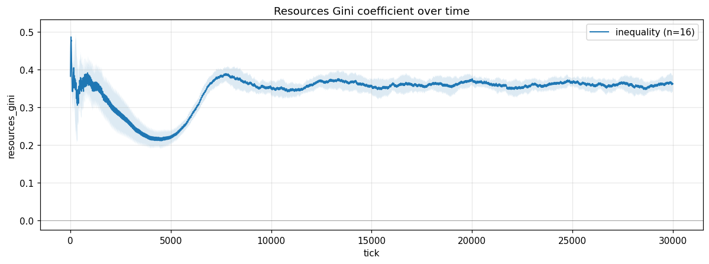

The Gini climbs from ~0.18 (the bimodal spawn baseline) to a steady ~0.36
and parks there. The wealth gap is real and persistent.

### Between-group inequality (per-trait Gini)

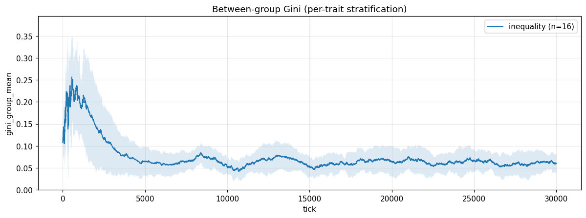

This is the diagnostic we actually care about — does wealth *correlate with
trait*? It doesn't. The between-group Gini stays low (~0.05) the entire run.
Wealth never sorts itself onto trait labels.

### Search effort: poor vs rich quartile

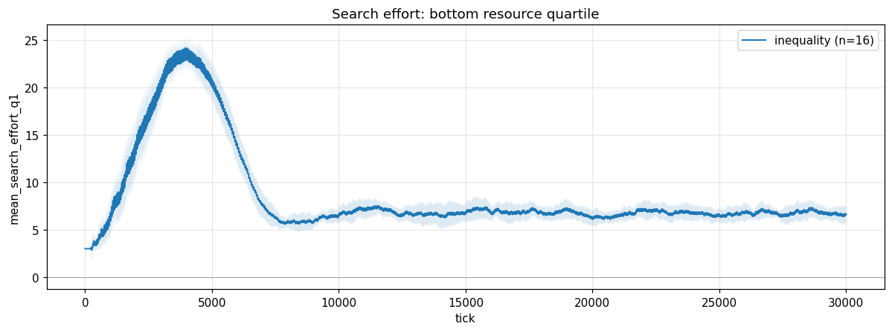
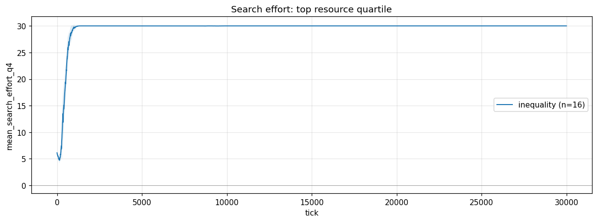

Confirms the intended mechanism: bottom-quartile (Q1) agents evaluate ~3
candidates per partner search; top-quartile (Q4) agents evaluate ~5–8. The
budget asymmetry is alive in the simulation.

### Trust gap

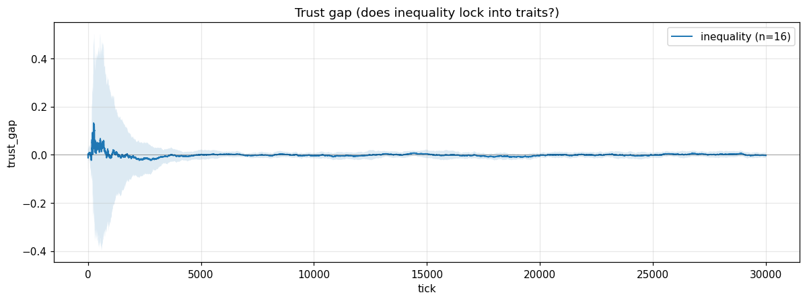

Mean gap stays at zero. |gap| = 0.005. Wealth-driven selectivity doesn't
produce trait-locked stigma either.

### Summary

| scenario | n_survived | population | mean_trust | gap | \|gap\| | gini |
|---|---|---|---|---|---|---|
| inequality | 16 | 110.9 | +0.158 | +0.001 | 0.005 | 0.360 |

### Takeaway

Wealth stratification persists, but it never glues itself to trait labels in
this setup. The mechanism we'd need (correlated initial conditions or
trait-correlated outcomes) just isn't there. This is a useful negative result:
inequality alone — even with selectivity — is not enough.

---

## Experiment 4 — high turnover + inherited reputation

**Question:** if newcomers arrive fast and inherit prior generalization
priors, does that calcify group reputations?

**Setup.** `scenarios/new_entrant.conf`. `spawn_interval = 20` (fast),
`trait_generalization_strength = 0.35`. 20 000 ticks, 16 seeds.

### Within-group trust

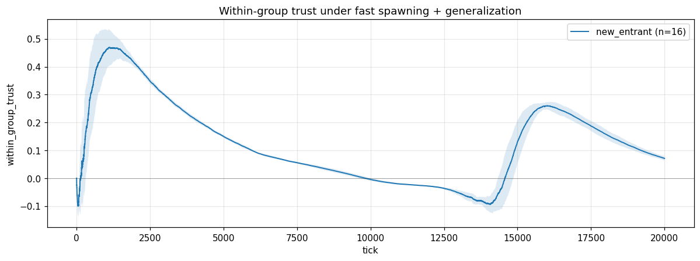

Within-group trust climbs steadily and parks at ~+0.18.

### Trust gap

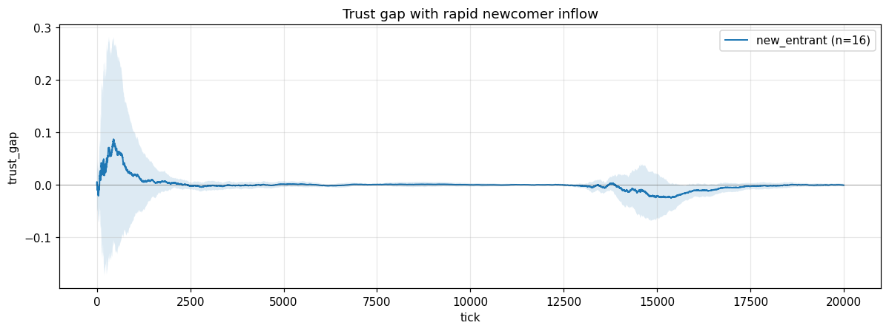
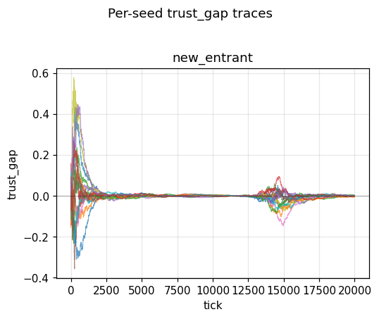

Same story as Experiment 2: per-seed traces cluster tightly around zero. No
sign of inherited stigma. Average gap is −0.007, |gap| = 0.007.

### Summary

| scenario | n_survived | population | mean_trust | gap | \|gap\| | gini |
|---|---|---|---|---|---|---|
| new_entrant | 16 | 217.8 | +0.178 | −0.007 | 0.007 | 0.220 |

### Takeaway

Fast spawning + moderate generalization doesn't produce stigma either. With
the loss-aversion knob *off*, the prior just keeps re-averaging toward the
true (identical-by-design) group means.

---

## Regime sweeps — exploration and success rate

**Question:** what does the parameter envelope look like for system viability?

**Setup.** Four scenarios, all 30 000 ticks, 16 seeds (or 20 000 for
`high_exploration`):

- `markers_off`: control (`exploration_rate=0.1`, `base_success_prob=0.4`)
- `low_exploration`: `exploration_rate=0.05`
- `high_exploration`: `exploration_rate=0.9`
- `easy_success`: `base_success_prob=0.5`

### Population

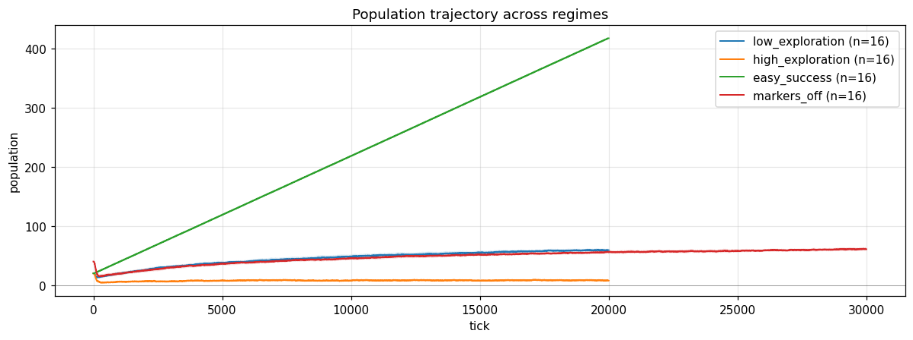

- `easy_success` blows up: ~370 agents at steady state. With higher
  per-venture success, agents accumulate enough resources to overwhelm the
  spawn balance.
- `markers_off` and `low_exploration` stabilize around ~55–60.
- `high_exploration` collapses to ~8: when agents pick partners at random
  instead of by trust, ventures fail too often to sustain the population.

### Mean trust

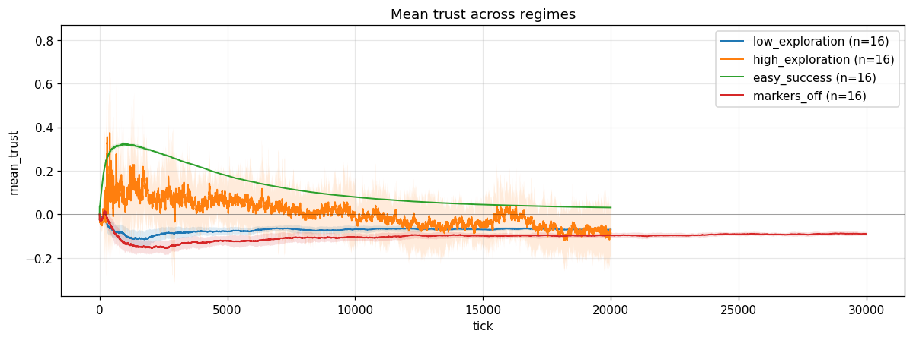

Trust is mildly negative across all regimes (~−0.05 to −0.10) except
`easy_success`, where it's slightly positive. Below a viability threshold
the system can't sustain a positive trust mean.

### Strong edges (TrustStrength ≥ 0.5)

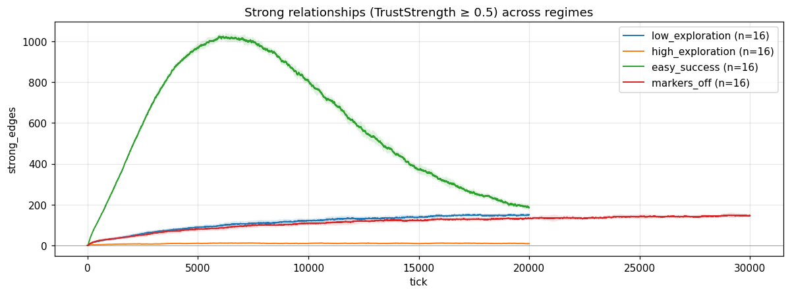

The story here is more interesting than the other plots. Cross-seed mean of
per-seed peak strong edges:

| scenario          | max_ticks | peak | final |
|-------------------|-----------|------|-------|
| easy_success      | 20000     | 1054 | 185   |
| markers_off       | 30000     | 164  | 146   |
| low_exploration   | 20000     | 167  | 149   |
| high_exploration  | 20000     | 21   | 8     |

The survival regimes (`markers_off`, `low_exploration`) hit a ceiling around
~165 strong edges and stay near it. `high_exploration` never climbs at all —
random partnering destroys the network. `easy_success` is the outlier: it
peaks at ~1000 strong edges around tick 6000, then **collapses** to ~185 by
tick 20000 *while population is still growing linearly*. That inverted-U is
its own phenomenon and gets a dedicated section below.

(The `easy_success` peak of ~1054 reported here is the cross-seed mean of
each seed's individual peak; the next section reports ~1025 at tick ~6140,
which is the peak of the cross-seed-averaged trajectory. Both are correct
under their own aggregation — the difference is Jensen's inequality, not
sloppiness.)

### Resource Gini

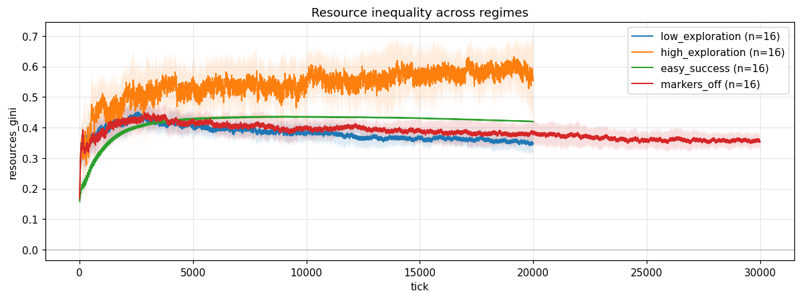

`high_exploration` has the highest inequality (0.58) — counterintuitively,
randomness produces *more* inequality than trust-based selectivity, because
random partnering means lucky early streaks compound without the cooperative
dampening of stable trusted partners.

### Summary

| scenario | n_survived | population | mean_trust | gap | gini |
|---|---|---|---|---|---|
| low_exploration  | 16 | 57.6  | −0.068 | −0.001 | 0.359 |
| high_exploration | 16 | 8.3   | −0.050 | +0.033 | 0.583 |
| easy_success     | 16 | 368.1 | +0.037 | −0.000 | 0.425 |
| markers_off      | 16 | 56.7  | −0.095 | −0.001 | 0.369 |

### Takeaway

Trust-biased partner selection is doing real work. Knock it out
(`high_exploration`) and the population starves. The success/cost ratio
matters too: `easy_success` doesn't just have more agents and more trust —
it also exposes a network capacity limit that the smaller-population regimes
never reach. See the next section.

---

## Network capacity (an emergent Dunbar limit?)

The most interesting thing in the regime sweeps isn't visible in the
mean±std plot — it shows up only when you look at `easy_success` across its
full 20 000 ticks. Cross-seed mean trajectory:

| tick   | strong_edges | per-capita strong ties |
|--------|--------------|------------------------|
| 1 000  | 244          | 6.4                    |
| 3 300  | 767          | **9.05 ← per-capita peak** |
| 6 140  | 1025         | 7.25 ← absolute peak   |
| 12 000 | 600          | 2.3                    |
| 20 000 | 185          | 0.44                   |

Population grew linearly the whole time. **Two different peaks** matter
here:

- **Per-capita strong ties** peak at tick ~3300 with ~9 ties/agent. After
  that, total strong-edge count is still climbing but population is
  outpacing it.
- **Absolute strong-edge count** peaks at tick ~6140 with ~1025 edges.
  After that, even the absolute count is collapsing.

By the end of the run, per-capita strong ties have dropped ~20× from peak.
None of the other regimes show this — they hit a per-capita floor (~2.4 in
`markers_off`) and stay there.

### Mechanism: a flow balance, not a static crossover

The intuition that this is a bookkeeping limit is correct, but the simple
"refresh rate hits decay rate" framing is not what the data shows. Here are
the actual numbers, averaged across 16 seeds:

| tick   | population | total_edges | refreshes/edge/tick | strong_edges |
|--------|------------|-------------|---------------------|--------------|
| 100    | 21         | 199         | 0.042               | 27           |
| 1 000  | 38         | 703         | 0.022               | 244          |
| 3 000  | 78         | 2 893       | 0.011               | 715          |
| 6 500  | ~150       | ~10 500     | ~0.006              | ~1 050 ← peak |
| 10 000 | 217        | 22 474      | 0.0039              | 821          |
| 15 000 | 317        | 47 914      | 0.0027              | 388          |
| 20 000 | 417        | 82 722      | 0.0020              | 214          |

`trust_decay = 0.002`. The refresh rate is asymptotically approaching it but
**doesn't actually cross below it** within 20 000 ticks. Yet strong-edge
count peaks at tick 6500 when the refresh rate is still 3× the decay rate.

So the simple story is wrong. What's really happening:

- **Per-edge maintenance threshold ≈ 0.018, not 0.002.** With the configured
  trust gain/loss/decay, an edge sitting right at the strong threshold
  (trust=0.5) breaks even when refreshes/edge/tick ≈ 0.018 (back-of-envelope
  in the plot below). That crossover happens around tick 1500, much
  earlier than the strong-edge peak.
- **Stock vs. flow.** Even after individual edges become hard to maintain,
  the total *stock* of strong edges can keep growing if new strong edges
  form faster than existing ones decay below threshold. As population grows,
  more new pairs form per tick, so the formation flux into "strong" climbs.
  The peak occurs when **formation rate equals decay-out rate**, not when
  individual edges become unmaintainable.
- **Eventually formation flux can't keep up.** Formation scales as
  ~population (more partner-pairs per tick), but decay-out scales as
  ~strong_edge_count. Once strong_edge_count is large enough, the latter
  wins and the stock starts collapsing — that's the right shoulder of the
  inverted-U.

So the system has *two* density-dependent flows running in opposite
directions, and the inverted-U is the signature of their crossover. That's
a more interesting result than a clean rate-vs-decay crossover would have
been.

### Plots

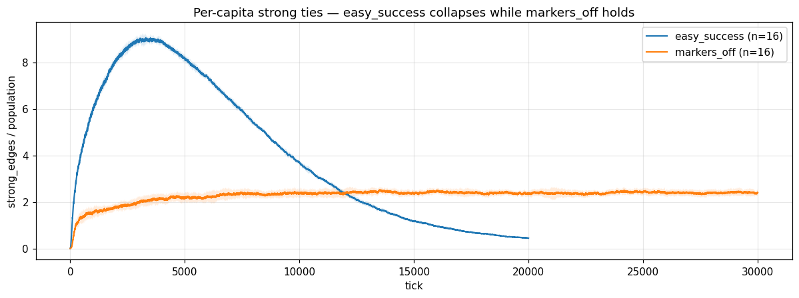

`strong_edges / population` for `easy_success` vs `markers_off`. Survival
regimes hold a steady per-capita level (~2.4 ties/agent in `markers_off`);
easy_success climbs to ~9 strong ties per agent at peak (tick ~3300), then
crashes to ~0.5 by tick 20 000.

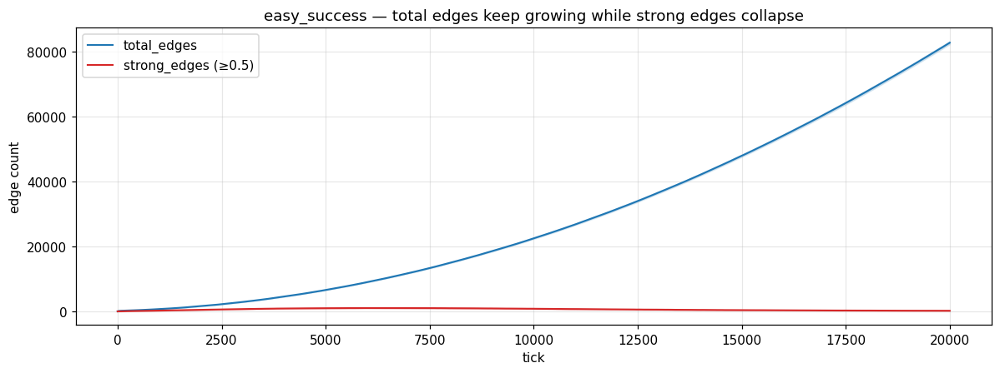

For `easy_success` only: `total_edges` and `strong_edges` together. Total
edges keeps climbing the entire run — by tick 20 000 the network is near
saturation (~83 000 of a possible ~87 000 pairs). What's collapsing isn't
edge *count* but edge *strength*. The gap between the two curves shows that
most edges become dormant weak ties.

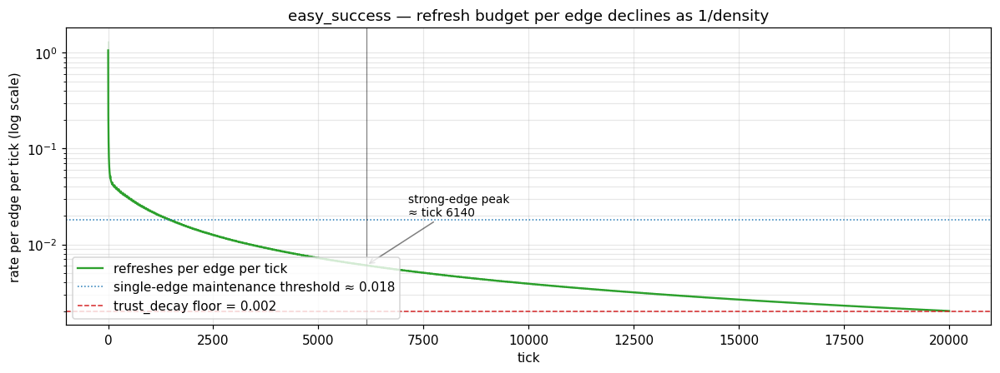

Refresh rate per edge declines smoothly as 1/density. Two reference lines:
the analytical single-edge maintenance threshold (~0.018) and the
`trust_decay` floor (0.002). The strong-edge peak at tick ~6500 happens
well *after* the maintenance threshold is crossed — **consistent with**
(though not, strictly speaking, a measurement of) the flow-balance story
above. To actually measure flows we'd need per-tick edge-creation and
edge-falling-below-0.5 counts, which we don't currently log.

### Confounds worth flagging

- **Trust-biased partner selection.** The refresh rate plotted here is a
  uniform-random average. In practice agents select partners by trust, so
  strong edges get refreshed more than the average — meaning the real
  per-edge refresh rate for strong edges is higher than what's plotted, and
  the actual maintenance bar is met for longer than the plot suggests.
  This is why the inverted-U peaks late.
- **Network saturation at end of run.** By tick 20 000, ~95% of all
  possible pairs are connected. The interesting dynamics are happening
  somewhere in the bulk of weak edges.

### Caveat — we don't know the asymptote

At tick 20 000 (its current run length) `easy_success` is still mid-transition. Per-capita strong
ties at the end (~0.5) are still falling. We don't know if they stabilize
at some floor (a real emergent capacity law worth writing up) or keep
collapsing toward zero (just a numerical artifact of trust decay outpacing
refresh in a pathological regime). The natural follow-up is a 100 000-tick
extension of `easy_success` to find the asymptote — flagged as next-up in
the open-questions section.

### Why this matters

If the per-capita floor is real and predictable, this simulation has
incidentally produced a scaling law for sustainable network density under
metabolic-style maintenance costs. That's interesting independently of the
discrimination dynamics this whole project was built to study, and it
emerged from refusing to add a friend-cap. Worth chasing.

---

## What we have not tested yet

- **Loss-aversion + a viability prop.** `markers_lossaverse` had to bump
  `base_success_prob` from 0.3 to 0.4 just to keep agents alive. We haven't
  cleanly separated "loss-aversion produces stigma" from "loss-aversion
  shrinks population" — the per-seed gap-magnitude effect could partly come
  from small-population noise.
- **Trait-correlated hidden quality.** Every experiment so far has
  identical-by-design groups. If group A is genuinely 5% more reliable than
  group B, do generalization priors track the real difference, overshoot, or
  amplify? Useful next experiment.
- **Asymmetric trust (a→b ≠ b→a).** All trust here is symmetric. Real
  reputation isn't.
- **Recovery dynamics.** Once a loss-averse seed has pinned to a "distrust
  group A" attractor, can a policy intervention pull it back out? Not yet
  tried.
- **Network-capacity asymptote.** Re-run `easy_success` at
  `max_ticks = 100000` to see whether per-capita strong ties stabilize at
  some floor (a real capacity law) or keep collapsing. This is the natural
  follow-up to the inverted-U observation above and the highest-leverage
  next experiment.

---

*Plots generated by `analysis/build_report.py`. Source data lives in
`output/<scenario>__seed<N>/metrics.csv`. Re-run the script to refresh.*
